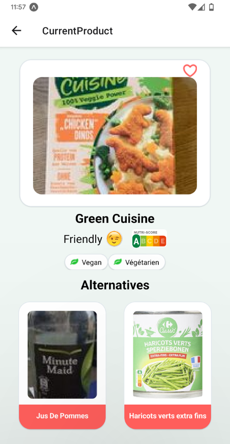

# UCare

___TODO: update then translate this documentation in english___

- [ ] Finalize login and personal accounts
- [ ] Deployment on the **App Store** and **Google Play**. Almost finished the deployment on GooglePlay, waiting approval
- [x] Cleaning code.
- [x] Add unit testing to front.
- [x] Add automation test, and deployment pipeline.
- [ ] Describe the testing and deployment plan.
- [ ] Update ReadMe. 

Nowadays, more and more people follow a particular diet, with different dietary restrictions linked to their allergies, beliefs or moral sense.

They need to know easily if the products they want to consume are in accordance with their diet, without wasting their time checking each ingredient one by one on a label sometimes difficult to read.

This application will be intended for all those who find themselves in these needs and will be available on phone.

---

## Application

<p style="display: flex;">
    
    
    
    
    
</p>

---

## Table des matières

-  **[Installation](#Installation)**
-  **[Code Quality & Testing Plan & CI / CD](#GoodPractice)**
-  **[Stack](#Stack)**
-  **[Functionalities](#Functionalities)**
-  **[Licence](#Licences)**

---
<a name='GoodPractice'></a>

## Code Quality

In the intent of improving code quality of this application, i implemented severals tools :
- first i used esLint on the front & the back-end part. I used AirBnB configuration.
- then i add husly to ensure that on every commit the linter as been runned, so the linter update will be done piece by piece

**eslint, jest, husky, github actions**

---
<a name='Installation'></a>

## Installation

Prérequis :
-  Avoir installé Git
-  Node JS

Dans votre dossier d'installation, créez votre git et connectez le à ce repository :
```
git init
git remote add origin https://github.com/VincentBernet/VegeDream
git pull origin master
```

Pour ensuite installer tous les composants nécessaires à l'application :

```
npm install
```

Installer l'application expo sur votre smartphone :
```
Android : https://play.google.com/store/apps/details?id=host.exp.exponent&hl=en&gl=US
Apple : https://apps.apple.com/us/app/expo-go/id982107779
```

---

1] Run la commande suivante pour lancer le front-end :
```
npm start
```
2] Ouvrir Expo sur votre smartphone puis scanner le QR code afficher sur votre terminale, l'application mobile se lance et fonctionne sur votre appareil 🔥


---

<a name='Stack'></a>

## Stack

```
- React-Native for the front-end
- Nest.js (framework node.js) for the back-end
- PostGreSql for the DB part
- Host on Heroku
```

OpenFoodFact : https://fr.openfoodfacts.org/produit/7613037398083/le-bon-vegetal-hache-cru-soja-a-cuisiner-herta

---

<a name='Functionalities'></a>

## Functionalities

Sur cette application, nous avons implémenté de multiples fonctionnalités telles que :

-  Scan d'un produit
-  Analyse du produit (vegan, végétarien, sans huile de palme, nutriscore)
-  Recherche et proposition d'alternative au produit consulté
-  Ajout, suppression et consultation de produit sous forme de favoris

---

<a name='Licences'></a>

## Licences

[](http://badges.mit-license.org)

-  **[MIT license](http://opensource.org/licenses/mit-license.php)**
-  Copyright 2021 © **[UCare's Team](#Equipe)**.
