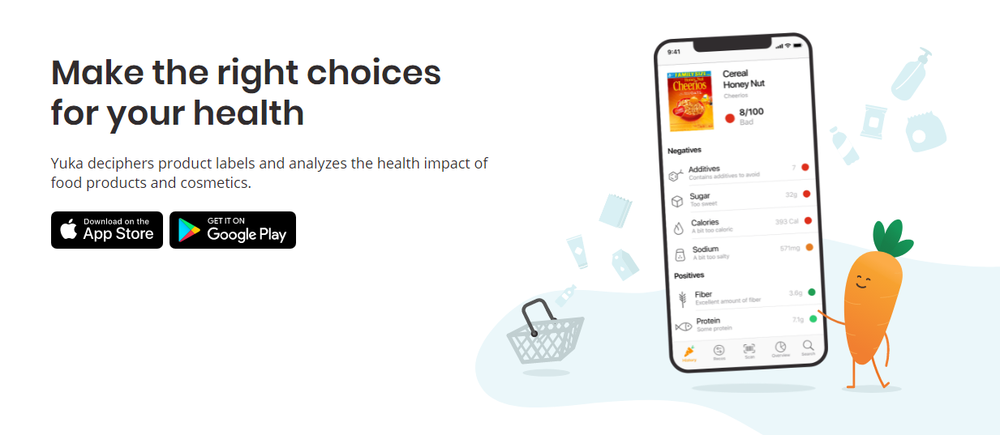

# UCare

_Yuka Like_

De nos jours, de plus en plus de personnes suivent un régime particulier, avec différentes restrictions alimentaires liées à leurs allergies, convictions ou sens moral.

Ils ont besoin de savoir facilement si les produits qu’ils souhaitent consommer sont conformes à leur régime, sans perdre leur temps à vérifier chaque ingrédient un par un sur une étiquette parfois difficilement lisible.

Cette application sera destinée à tous ceux qui se retrouvent dans ces besoins et sera disponible sur téléphone.

---

## Application

<p align="center"></p>

At ducimus porro est labore temporibus non sequi officiis. Qui galisum dignissimos quo labore voluptates non amet mollitia sit sunt odit est sint consectetur est possimus sunt!

Est Quis aperiam et praesentium blanditiis non debitis natus At aspernatur dicta in maxime ipsam est adipisci officia. Aut sunt consequuntur 33 ipsa nostrum sit magnam voluptas et omnis veniam sit nemo distinctio sit molestiae inventore. Eum molestias ipsa aut voluptates deleniti ut voluptatibus aut eius facilis est architecto voluptatem qui voluptatem magnam non reiciendis ipsum. Id quidem explicabo aut quisquam illum et fugit repellat.

---

## Table des matières

-  **[Installation](#Installation)**
-  **[Stack](#Stack)**
-  **[Fonctionnalité](#Fonctionnalité)**
-  **[Équipe & Contact](#Equipe)**
-  **[Licence](#Licences)**

---
<a name='Installation'></a>
## Installation

Dans votre dossier d'installation, créez votre git et connectez le à ce repository :

```
git init
git remote add origin https://github.com/VincentBernet/VegeDream
git pull origin master
```

<span style="color:red">! TODO !</span>

Pour ensuite installer tous les composants nécessaires à l'application :

```
npm install
```

Pour lancer l'application :

```
npm start
```
---
<a name='Stack'></a>
## Stack

```
- React Native
- Node JS, backend
- DB à déterminer
```

OpenFoodFact : https://fr.openfoodfacts.org/produit/7613037398083/le-bon-vegetal-hache-cru-soja-a-cuisiner-herta

---
<a name='Fonctionnalité'></a>
## Fonctionnalité

Sur cette application, nous avons implémenté de multiples fonctionnalités telles que :

-  LoLorem ipsum dolor sit amet. Hic consectetur voluptatem.
-  Lorem ipsum dolor sit amet. Hic consectetur voluptatem
-  LoLorem ipsum dolor sit amet. Hic consectetur voluptatem.
-  Lorem ipsum dolor sit amet. Hic consectetur voluptatem

---
<a name='Equipe'></a>
## Équipe & Contact

> Cette application a été réalisée par 7 étudiants dans le cadre de leur cursus d'ingénieur à l'EFREI PARIS : <br>

-  **[Diogo Gabriel](https://www.linkedin.com/in/diogo-branco-gabriel-06133613b/)** & **[Thomas Damasse](https://www.linkedin.com/in/thomas-damasse-651650185/)**
-  **[Matthieu Gédéon](https://www.linkedin.com/in/matthieu-g%C3%A9d%C3%A9on-6015621a0/)** & **[Marie Léonie](https://www.linkedin.com/in/marie-l%C3%A9onie-serizot/)** & **[Maria Sadek](https://www.linkedin.com/in/maria-sadek-4624651a1/)**
-  **[Vincent Bernet](https://www.linkedin.com/in/vincent-bernet/)** & **[Vincent Lacrouts](https://www.linkedin.com/in/vincent-lacrouts/)**

> N'hésitez pas à nous contacter !
---
<a name='Licences'></a>
## Licences

[](http://badges.mit-license.org)

-  **[MIT license](http://opensource.org/licenses/mit-license.php)**
-  Copyright 2021 © **[UCare's Team](Equipe)**.
