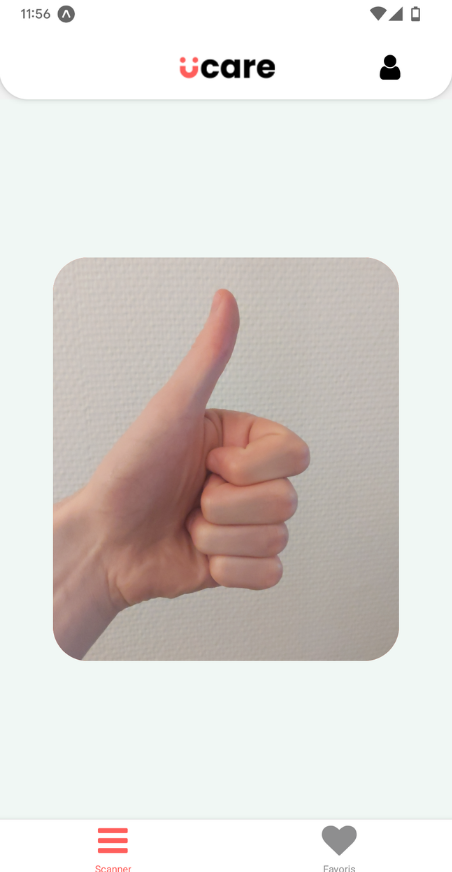
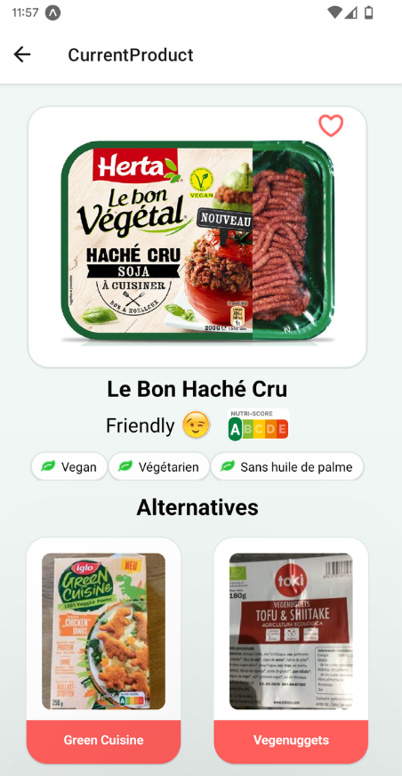
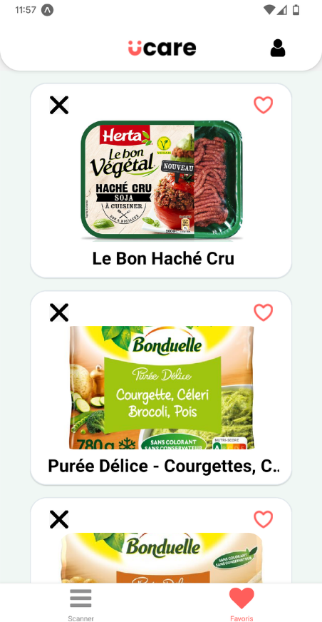

# UCare

Nowadays, more and more people follow a particular diet, with different dietary restrictions linked to their allergies, beliefs or moral sense.

They need to know easily if the products they want to consume are in accordance with their diet, without wasting their time checking each ingredient one by one on a label sometimes difficult to read.

This application will be intended for all those who find themselves in these needs and will be available on phone.

UCare is available on Google play just there : https://play.google.com/store/apps/details?id=com.ucareapp.app

---

## Application

<p style="display: flex;">
    
    
    
    
</p>

---

## Table of Contents
-  **[Code Quality & Testing Plan](#GoodPractice)**
-  **[Technical Stack & Code Architecture](#Stack)**
-  **[Functionalities](#Functionalities)**
-  **[Installation & Deployment](#Installation)**
-  **[Licence](#Licence)**

---
<a name='GoodPractice'></a>

## Code Quality & Testing Plan

In the intent of improving code quality of this application, i implemented severals tools :
- Used **ESLint** as a linter on the front & the back-end part with the AirBnB configuration, to replicate professional rules.
- For the testing part, i used **Jest** (again on both front & back), to cover the critical part of the application and i tried to maximize the app testing coverage.
- Then i choosed **Husky** to ensure that on every commit the linter as been runned, so the linter update will be done piece by piece, and on each push Jest unit test are also runned, if at least a test fail then the push is canceled.
- Finally i implemented **Github Actions**, to use it as a workflow to run the whole linter & testing process when a pull request or someone is trying to merge and push on main branch.

Concept and patern i followed during the development :
- On the front part, i tried to segment my code in as many react component as possible, to reuse them on multiple pages, and unit test them easely
- All of functions have been extract has much as possible, again to ensure easy Unit testing, and have been put in a utility folder within a named accordly named with their functional part and domain
- All the stylesheet in a eponym files for each component and pages, same to define interface in specific files, used Dictionnary aswell to quick and easely update the wording.

---
<a name='Stack'></a>

## Technical Stack & Code Architecture

```
- React-Native for the front-end
- Nest.js (framework node.js) for the back-end
- PostGreSql for the DB part
- Host on Heroku
```

OpenFoodFact : https://fr.openfoodfacts.org/produit/7613037398083/le-bon-vegetal-hache-cru-soja-a-cuisiner-herta

---
<a name='Installation'></a>

## Installation & Deployment

Prerequisite :
-  Git
-  Node.js

In your installation folder, create your git and connect it to this repository:
```
git init
git remote add origin https://github.com/VincentBernet/UCare
git pull origin main
```

Then install all the necessary dependencies for the application:
```
npm install
```

Install the expo application on your smartphone:
```
Android : https://play.google.com/store/apps/details?id=host.exp.exponent&hl=en&gl=US
Apple : https://apps.apple.com/us/app/expo-go/id982107779
```

1] Run the following command to launch the front end:
```
npm start
```
2] Open Expo on your smartphone then scan the QR code displayed on your terminal, the mobile application will launch and run on your device 🔥

## Deployment process

Strongly encourage you to follow the expo documentation : https://docs.expo.dev/submit/android/ 

---

<a name='Functionalities'></a>

## Functionalities

On this application, we have implemented multiple features such as :

- Scan of a product
- Analysis of the product (vegan, vegetarian, without palm oil, nutriscore)
- Search and proposal of alternative to the consulted product
- Addition, deletion and consultation of products in the form of favorites

---

<a name='Licence'></a>

## Licence

[](http://badges.mit-license.org)

-  **[MIT license](http://opensource.org/licenses/mit-license.php)**
-  Copyright 2021 © **[UCare's Team](#Equipe)**.
