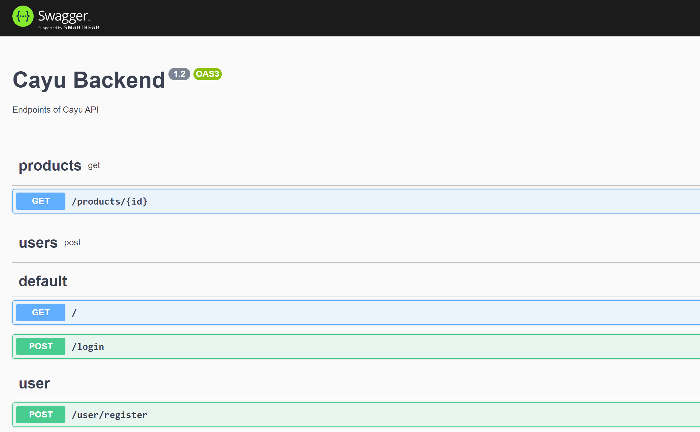
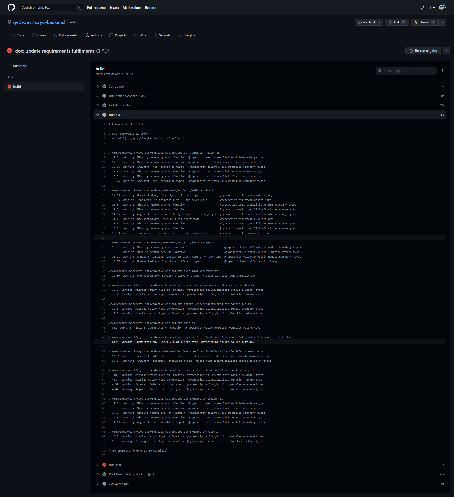
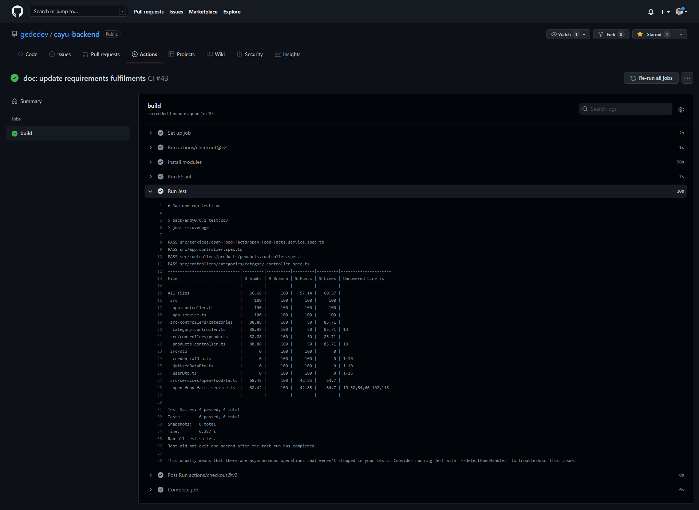
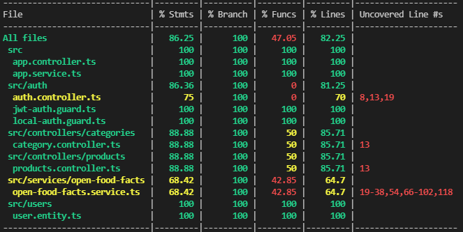

# Cayu Backend

## Installation

```bash
$ npm install
```

## Running the app

```bash
# development
$ npm run start

# watch mode
$ npm run start:dev

# production mode
$ npm run start:prod
```

## Test

```bash
# unit tests
$ npm run test

# e2e tests
$ npm run test:e2e

# test coverage
$ npm run test:cov
```

## Database

### Docker Image

Use the official image of Postgres
https://hub.docker.com/_/postgres
Check if the variables in `src/orm.config.ts` are the same as the image

### PgAdmin

You can also use PgAdmin to create a DB: https://www.pgadmin.org/

## Docker Compose

Work In Progress: Node modules error in API Image.

```
docker-compose up -d
```

Launch the DB but error might occur on the API. Launch API with:

```
npm start
```

# Checkpoints report for the project

You **MUST** append a filled copy of this document at the end of your `README.MD`.

This document serves three main purposes:

- providing you a clear list of my expectations (check each point when done) ;
- ensuring I do not miss some of your engineering during the review ;
- asking for additional information that helps me during the review.

## Notice

Check every applicable checkbox in the above list. For each one, provide the requested additional information.

In your explanation, please provide links (file + line) to relevant parts of your source code and tests if applicable.

### Caption

🔵 means the checkbox is mandatory. If missing or absolutely not satisfying, it may cost you 0.5 penalty point.

## Expectations

### Input validation

- ✅ Strictly and deeply validate the type of every input (`params, querystring, body`) at runtime before any processing. **[1 point]** 🔵

  > _How did you achieve this?_
  >
  > We used the global ValidationPipe() on our NestJs app to ensure some validation inputs. It works thanks to Data Object Models containaing decorators around their attributes. At each request, if the body is specified with a Dto class containings class-validators decorators around the attributes, they will be verified and stop the process if said types / format are not valid.

- ✅ Ensure the type of every input can be inferred by Typescript at any time and properly propagates across the app. **[1 point]** 🔵

  > _How did you achieve this?_
  > We tried to make the best use of Intellisense coupled with typed functions and classes in order to help with the autocompletion and verification during developement.

- [ ] Ensure the static and runtime input types are always synced. **[1 point]** 🔵
  > _How did you achieve this? If extra commands must be run before the typescript checking, how do you ensure there are run?_

### Authorisation

- ✅ Check the current user is allowed to call this endpoint. **[1 point]** 🔵

  > _How did you achieve this?_
  >
  > We made use of Passport strategy pattern using guards around the routes that needs protection. More specifically, we used an AuthGuard that checks if provided credentials matches credentials from a given mail, which then returns a JWT. The protected resources routes contains a JWTGuard which checks if the Bearer has a valid token.

- ✅ Check the current user is allowed to perform the action on a specific resource. **[1 point]** 🔵

  > _How did you achieve this?_
  >
  > Unfinished. The JwtGuard can ensure that a JWT is valid, thus blocking the request if unvalid. Our endpoint is not finished but the route we wanted to securize using that pattern was for a Post to modify the username.

- ✅ Did you build or use an authorisation framework, making the authorisation widely used in your code base? **[1 point]**

  > _How did you achieve this?_
  >
  > Like told earlier, we used Passport, a library which provides a logic of Guards and Strategies. Strategies are implemented by the Guards. Strategies provides the logic to validate (reference to the name of the function used to do so in a [name].strategy.ts file) a request. Guards are decorator used around a route to say that said route will implement said strategy.

- [ ] Do you have any way to ensure authorisation is checked on every endpoint? **[1 point]**
  > _How did you achieve this?_
  >
  > It is pretty easy to forget authorising some action.
  > For obvious reasons, it may lead to security issues and bugs.
  > At work, we use `varvet/pundit` in our `Ruby on Rails` stack. It can raise exception just before answering the client if authorisation is not checked.
  > https://github.com/varvet/pundit#ensuring-policies-and-scopes-are-used

### Secret and configuration management

- ✅ Use a hash for any sensitive data you do not need to store as plain text. 🔵

  > _Also check this if you do not store any password or such data (and say it here)._
  >
  > We used bcrypt in order to hash our passwords before saving new users in the DB. The hash verification is compliant with our Guard / Strategy implementations from Passport.

- [ ] Store your configuration entries in environment variables or outside the git scope. **[1 point]** 🔵

  > _How did you achieve this?_

- [ ] Do you provide a way to list every configuration entries (setup instructions, documentation, requireness... are appreciated)? **[1 point]**

  > _How did you achieve this?_

- [ ] Do you have a kind of configuration validation with meaningful error messages? **[1 point]**
  > _How did you achieve this?_

### Package management

- ✅ Do not use any package with less than 50k downloads a week. 🔵

- [ ] Did you write some automated tools that check no unpopular dependency was installed? If yes, ensure it runs frequently. **[1 point]**

  > _How did you achieve this? A Github Action (or similar) and compliance rule for pull requests are appreciated._

- [ ] Properly use dependencies and devDevepencies in your package.json. **[0.5 points]**
  > _How did you achieve this?_

### Automated API generation

- ✅ Do you have automated documentation generation for your API (such as OpenAPI/Swagger...)? **[1 point]** 🔵

  > _How did you achieve this?
  > You must link your documentation for review (a Github page, a ZIP archive, an attachment to the release notes...)._
  >
  > You can find the Swagger there when running the projec : **http://localhost:8080/swagger/**

  <p>
    
  </p>

- [ ] In addition to requireness and types, do you provide a comment for every property of your documentation? **[1 point]**

  > _How did you achieve this?_

- [ ] Do you document the schema of responses (at least for success codes) and provide examples of payloads? **[1 point]**

  > _How did you achieve this?_

- [ ] Is your documentation automatically built and published when a commit reach the develop or master branches? **[1 point]**
  > _How did you achieve this?_

### Error management

- [ ] Do not expose internal application state or code (no sent stacktrace in production!). **[1 point]** 🔵

  > _How did you achieve this?_

- [ ] Do you report errors to Sentry, Rollbar, Stackdriver… **[1 point]**
  > _How did you achieve this?_

### Log management

- [ ] Mention everything you put in place for a better debugging experience based on the logs collection and analysis. **[3 points]**

  > _How did you achieve this?_

- [ ] Mention everything you put in place to ensure no sensitive data were recorded to the log. **[1 point]**

  > _How did you achieve this?_

### Asynchronous first

- ✅ Always use the async implementations when available. **[1 point]** 🔵

  > _List all the functions you call in their async implementation instead of the sync one._
  >
  > _Ex: I used `await fs.readFile` in file `folder/xxx.ts:120` instead of `fs.readFileSync`._
  >
  > - We used `async validate(payload: any)` in file `src\auth\jwt.strategy.ts` instead of simple sync validate function.
  > - We used `async getProductInformation(id)` in file `src\services\open-food-facts\open-food-facts.service.ts:14` instead of sync function.
  > - We used `async () => {await expect(service.getProductInformation(...)).toBeDefined();}` in all of our test file `src\services\open-food-facts\open-food-facts.service.spec.ts:22` instead of regular test function.
  >   We used Promise based functions from TypeORM in `src/users/users.service.ts`, with handling in `src/users/users.controller.ts`
  >
  > Ex: I used `await fs.readFile` in file `folder/xxx.ts:120` instead of `fs.readFileSync`.

- ✅ No unhandled promise rejections, no uncaught exceptions… **[1 point]** 🔵
  > _For example, how do you ensure every promise rejection is caught and properly handled? Tips: one part of the answer could be the use of a linter._
  >
  > There we apply an **Eslint rules** that verify that we got no floating promises : `@typescript-eslint/no-floating-promises': 'error'`. We set it to errors to ensure that we won't bypass it.

### Code quality

- ✅ Did you put a focus on reducing code duplication? **[1 point]**

  > _How did you achieve this?_
  >
  > Yes, we try to respect DRY as much as possible. On every services used by our controllers, we extract as many reusibable function in utils file to reuse them as soon as needed.

- ✅ Eslint rules are checked for any pushed commit to develop or master branch. **[1 point]**

  > _Please provide a link to the sample of Github Action logs (or similar)._
  >
  > On each push to the main branch Eslint is runned, via **[Github Actions](https://github.com/gededev/cayu-backend/blob/main/.github/workflows/main.yml)**, here is the screen of Github Action logs :

  <p>
    
  </p>

  > Implemented aswell automated Eslint's runs on each commit on all branch via **[Husky 🐶](https://typicode.github.io/husky/#/?id=automatic-recommended)**, the goal here is to ensure that each dev of the team respect the coding rules at each commit.

### Automated tests

- ✅ You implemented automated specs. **[1 point]** 🔵

  > _Please provide a link to the more complete summary you have._
  >
  > Here is the last and more complete summary we have : **[Jest summary Link](https://github.com/gededev/cayu-backend/runs/5545203282?check_suite_focus=true)**

  <p>
    
  </p>

- ✅ Your test code coverage is 75% or more. **[1 point]** 🔵

  > _Please provide a link to the `istanbul` HTML coverage summary (or from a similar tool)._
  >
  > On each push to the main branch Jest is runned, via **[Github Actions](https://github.com/gededev/cayu-backend/blob/main/.github/workflows/main.yml)**, and aswell on every local push with **[Husky 🐶](https://typicode.github.io/husky/#/?id=automatic-recommended)**, here is the screen of the test coverage (80% +
  > test-coverage), we used **[Istanbul](https://istanbul.js.org/docs/tutorials/jest/)** because it was already built in Jest:

  <p>
    
  </p>

- ✅ Do you run the test on a CD/CI, such as Github Action? **[1 point]**

  > _Please provide a link to the latest test summary you have, hosted on Github Action or similar._
  >
  > On each push to the main branch Jest is runned, via **[Github Actions](https://github.com/gededev/cayu-backend/blob/main/.github/workflows/main.yml)**, here is the screen of Github Action logs, or you can get with this **[link](https://github.com/gededev/cayu-backend/runs/5545203282?check_suite_focus=true)**:

  <p>
    
  </p>

  > As said before, we implemented aswell automated Jest's unit test on each **push** on all branch via **[Husky 🐶](https://typicode.github.io/husky/#/?id=automatic-recommended)**, the goal here is to ensure that each dev of the team don't create side effects and implement breaking change without slowing them too much (you can skip test with --no-verify in your push command)
